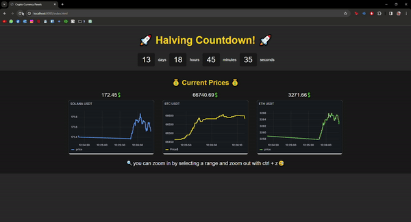

# Crypto Price Tracker App 
This is a spring boot application that gets the latest crypto prices from the Binance API and store the data in **POSTGRESQL** db using the messaging que **RabbitMQ**.
The app  displays the latest prices of the cryptocurrencies and their price graphs with timeline using **GRAFANA**.
The app uses **Redis** to optimize the performance of the app by caching the current price data. The app also has a countdown for the bitcoin halving.


 # Features
    
- Implement real-time data tracking and storage from the Binance API using RabbitMQ and PostgreSQL
- Implementing the display of price graphs using Grafana panels.
- Implementing caching for current price data using Redis.
- Implementing a countdown for the bitcoin halving.
- Utilizing Docker Compose to orchestrate the required images for the application.


# Preview


<p align="center">
    
  
</p>
<br>
<p align="center">
  
</p>


# How to Run and Setup
Clone the repository:
```bash
git clone https://github.com/satas20/CryptoPriceTrackerApp
```
Cd into the directory and open with your IDE:
```bash
cd CryptoPriceTrackerApp
```

Run Docker Daemon:
```bash
Start-Service Docker
```

If your IDE doesn't support DockerCompose, run the following command:
```bash
docker-compose up
```


Run the project without executable jar file:
```bash
mvn spring-boot:run
```

Setup the GRAFANA dashboard:
```bash
go to http://localhost:3000/
Login with username: admin and password: admin
Add the datasource with the following details:
Type: Postgresql | Host url:db:5432 | Database: postgres | Username: postgres Password: 12345 | SSL Mode: disable
Import the dashboard from the file in the directory: grafana/cryptoAppDash.json
```
Check the app in the browser:
```bash
http://localhost:8080/index.html
```
Success! You are now running the app.

